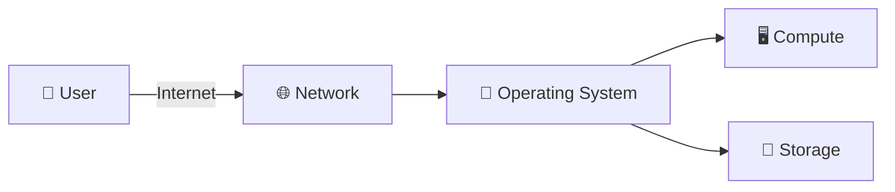

# 🧩 Cloud Infrastructure Components
### *Understanding the building blocks behind every cloud deployment*

> Every cloud system — no matter how complex — is built from four fundamental pillars. This document breaks down each one as observed in the KillerCoda Linux environment.

---

## 🖥️ Compute Resources

| | |
|---|---|
| **🎯 Purpose** | |
| **☁️ Why it matters in cloud computing** | |
| **🐧 How it relates to the KillerCoda environment** | |

---

## 💾 Storage Resources

| | |
|---|---|
| **🎯 Purpose** | |
| **☁️ Why it matters in cloud computing** | |
| **🐧 How it relates to the KillerCoda environment** | |

---

## 🌐 Networking Resources

| | |
|---|---|
| **🎯 Purpose** | |
| **☁️ Why it matters in cloud computing** | |
| **🐧 How it relates to the KillerCoda environment** | |

---

## 🐧 Operating System

| | |
|---|---|
| **🎯 Purpose** | |
| **☁️ Why it matters in cloud computing** | |
| **🐧 How it relates to the KillerCoda environment** | |

---

## 🔗 How They Work Together
*(2–4 sentences connecting compute, storage, networking, and the OS into one working system — e.g. trace the journey of a single user request.)*

---
📁 *Part of the [CCM101 Cloud Computing Portfolio](../../README.md) — Laboratory 2: Build the Cloud Infrastructure Blueprint*

