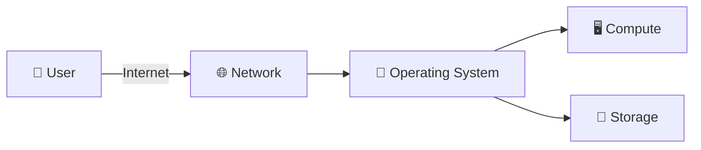

# 🧩 Cloud Infrastructure Components
### *Understanding the building blocks behind every cloud deployment*

> Every cloud system — no matter how complex — is built from four fundamental pillars. This document breaks down each one as observed in the KillerCoda Linux environment.

---

## 🖥️ Compute Resources

| | |
|---|---|
| **🎯 Purpose** | Compute resources provide the processing power (CPU) and memory (RAM) needed to run applications, execute code, and process data. |
| **☁️ Why it matters in cloud computing** | Compute is the core resource cloud providers sell — it determines how much work a server can handle at once. Cloud platforms let engineers scale compute up or down on demand, instead of buying physical hardware, which is the foundation of elastic, pay-as-you-go cloud infrastructure. |
| **🐧 How it relates to the KillerCoda environment** | The KillerCoda server itself is a compute resource — a virtual machine with 1 CPU core (Intel Xeon E312xx) and 1.9 GiB of RAM, as shown by `lscpu`, `nproc`, and `free -h`. All commands, scripts, and processes run on this allocated compute capacity. |

---

## 💾 Storage Resources

| | |
|---|---|
| **🎯 Purpose** | Storage resources hold data persistently — files, databases, logs, and the operating system itself — so information survives even after a process ends or the system restarts. |
| **☁️ Why it matters in cloud computing** | Cloud storage separates data from compute, allowing storage to be scaled, backed up, replicated, or attached to different servers independently. This is essential for durability, disaster recovery, and cost efficiency in real deployments. |
| **🐧 How it relates to the KillerCoda environment** | The KillerCoda VM's disk is visible through `df -h` and `mount`, showing partitions like `/dev/vda1` (19 GiB root filesystem, ext4) mounted at `/`, plus `/boot` and `/boot/efi` — these are the storage resources the system depends on to persist files and boot properly. |

---

## 🌐 Networking Resources

| | |
|---|---|
| **🎯 Purpose** | Networking resources connect systems together and to the internet, allowing data to travel between users, servers, and other services. |
| **☁️ Why it matters in cloud computing** | Networking is what makes "cloud" possible in the first place — without it, compute and storage would be isolated. In the cloud, networking also handles security (firewalls, private subnets) and traffic routing between distributed services. |
| **🐧 How it relates to the KillerCoda environment** | The environment's networking is visible through `hostname -I`, which returned two IP addresses: `172.30.1.2` (the server's assigned network address) and `172.17.0.1` (a Docker bridge interface). These addresses are what allow the server to be reached and to communicate on its network. |

---

## 🐧 Operating System

| | |
|---|---|
| **🎯 Purpose** | The operating system manages hardware resources and provides the environment in which all software, commands, and services run. |
| **☁️ Why it matters in cloud computing** | The OS is the layer that ties compute, storage, and networking together — cloud engineers must understand it to install software, configure services, manage permissions, and troubleshoot issues on any server they deploy. |
| **🐧 How it relates to the KillerCoda environment** | The KillerCoda server runs Ubuntu 24.04.4 LTS with kernel 6.8.0-138-generic, confirmed via `cat /etc/os-release` and `uname -r`. This OS is what allowed all the compute, storage, and networking commands used throughout this lab to function. |

---

## 🔗 How They Work Together
When a user connects to this server, the request travels in over the **network** (via its IP address, `172.30.1.2`) and is received by the **operating system** (Ubuntu 24.04), which manages how that request gets handled. The OS then allocates **compute** resources — CPU cycles and memory — to process the request, and reads or writes any needed data to **storage** (the `/dev/vda1` filesystem). All four components depend on one another: without networking, the server can't be reached; without the OS, the hardware can't be controlled; without compute, nothing can be processed; and without storage, no data can persist between requests.

---
📁 *Part of the [CCM101 Cloud Computing Portfolio](../../README.md) — Laboratory 2: Build the Cloud Infrastructure Blueprint*

