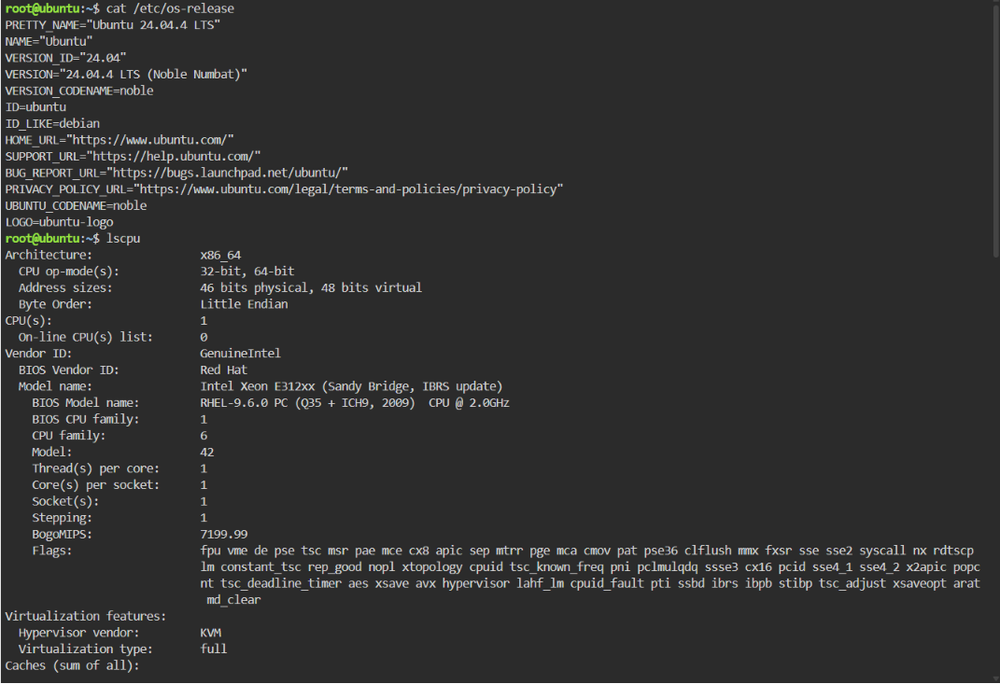
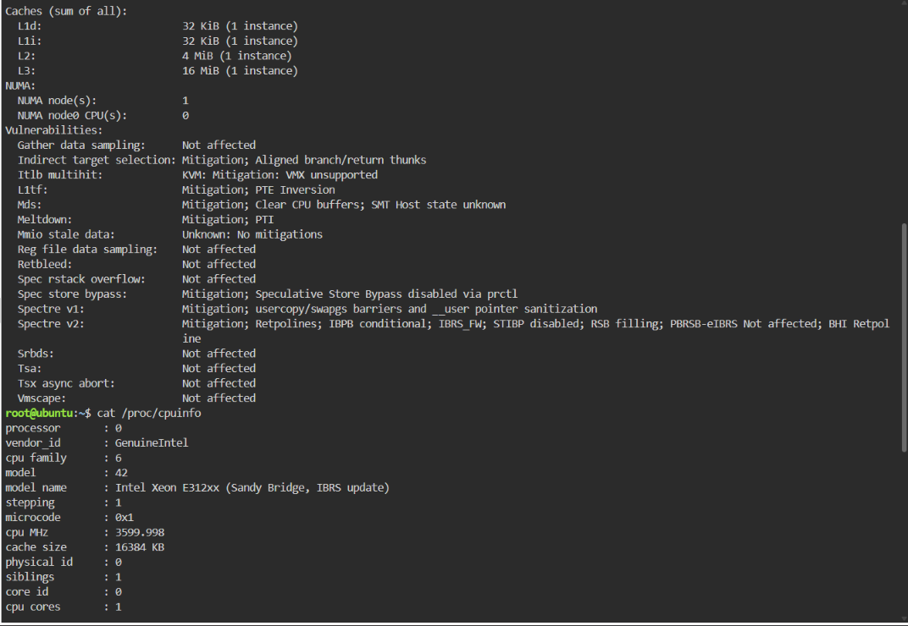
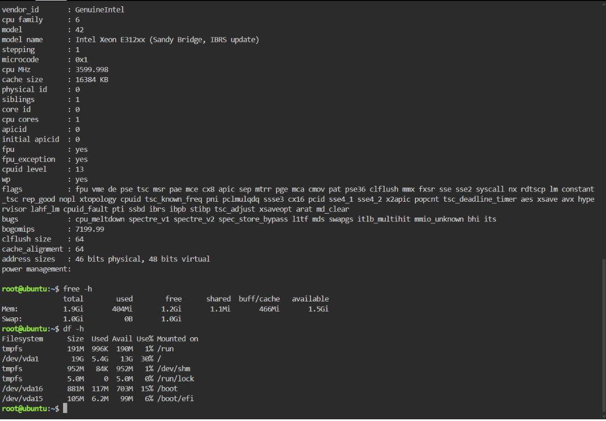

# ☁️ Laboratory 3 — Multi-Cloud Explorer
### *CloudNova Technologies — Cloud Evaluation Team*

> 🎯 **Mission:** Explore AWS, Azure, and GCP, compare their services, and recommend the right platform for the right problem — because a real Cloud Solutions Architect doesn't just pick the popular option.

---

## 🧭 Mission Log

| Field | Details |
|---|---|
| 👨‍💻 Student | Victor Juvnile M.Ventura |
| 🏫 Course | CCM101 – Cloud Computing |
| 📅 Date Completed | 09/11/2026 |
| 🗂️ Repository | `Laboratory-03-Multi-Cloud-Explorer` |

---

## 📁 What's Inside This Mission Folder

| File | Purpose |
|---|---|
| 📄 `aws-research.md` | Deep dive into Amazon Web Services |
| 📄 `azure-research.md` | Deep dive into Microsoft Azure |
| 📄 `gcp-research.md` | Deep dive into Google Cloud Platform |
| 📊 `cloud-platform-comparison.md` | Side-by-side comparison tables |
| 🧑‍💼 `client-recommendations.md` | Real-world client scenarios solved |
| 🪞 `reflection.md` | What this mission taught me |
| 📸 `screenshots/` | Visual evidence of the mission |

---

## 🐧 Linux Investigation — KillerCoda Terminal

> *Every cloud starts with a server. Let's inspect one.*

📸 **Terminal Evidence:**

*Caption: [e.g. OS and CPU info]*

*Caption: [e.g. Memory usage]*

*Caption: [e.g. Disk space]*

### ☁️ If This Server Moved to the Cloud...

> **Question:** Which AWS, Azure, and GCP services could host it?

| Provider | Recommended Service | Why It Fits |
|---|---|---|
| 🟧 AWS | **Amazon EC2** | EC2 can provide a virtual Linux server with configurable CPU, memory, and storage resources. |
| 🔵 Azure | **Azure Virtual Machines** | Azure Virtual Machines can host Linux operating systems and allow the resources to be adjusted based on workload requirements. |
| 🔴 GCP | **Compute Engine** | Compute Engine provides configurable virtual machines that can run Linux and can be scaled according to the server's requirements. |

---

## ✅ Mission Status

- [x] Checkpoint 1 — Portfolio expanded
- [x] Checkpoint 2 — Three platforms researched
- [x] Checkpoint 3 — Platforms compared
- [x] Checkpoint 4 — Client recommendations made
- [x] Checkpoint 5 — Services matched
- [x] Checkpoint 6 — Decision matrix built
- [x] Checkpoint 7 — Linux investigation complete
- [x] Checkpoint 8 — Reflection written

---

