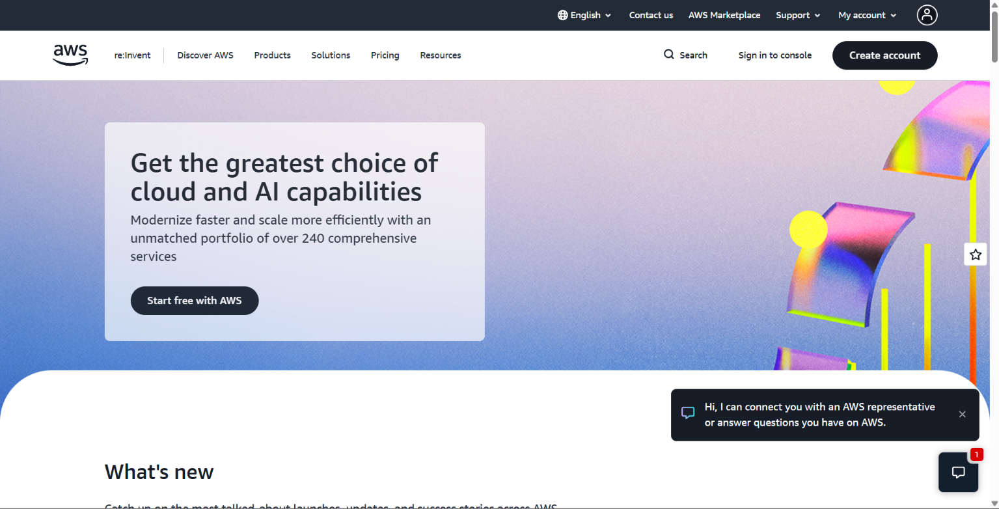

# 🟧 Amazon Web Services (AWS)
### *The Pioneer of the Cloud*

> 🕵️ Researched from official AWS documentation as part of CloudNova's Cloud Evaluation Mission.

---

## 📌 Brief Overview
> *In a nutshell: what is AWS, who runs it, and why does it matter?*

Amazon Web Services (AWS) is a cloud computing platform provided by Amazon. It offers services for computing, storage, databases, networking, security, analytics, and application development. AWS is widely used by businesses because it provides cloud resources on demand and allows organizations to scale without maintaining their own physical infrastructure.

---

## 🌍 Global Infrastructure
> *How far does AWS's footprint reach?*

| Metric | Details |
|---|---|
| 🌐 Regions | **39 geographic Regions** |
| 🏢 Availability Zones | **123 Availability Zones** |
| 📶 Edge Locations | **Hundreds of edge locations worldwide** |

---

## 🖥️ Cloud Management Console
> **Name:** AWS Management Console

The AWS Management Console is a web-based interface used to create, configure, monitor, and manage AWS resources. Users can launch virtual machines, create storage, manage databases, configure networks, monitor resources, and control security settings from the console.

---

## 🧩 Four Core Services

| # | Service | Category | What It Does |
|---|---|---|---|
| 1️⃣ | **Amazon EC2** | Compute | Provides virtual servers that can run applications and workloads in the cloud. |
| 2️⃣ | **Amazon S3** | Storage | Stores files, images, videos, backups, and other objects in the cloud. |
| 3️⃣ | **Amazon RDS** | Database | Provides managed relational databases without requiring users to manage the database server manually. |
| 4️⃣ | **Amazon VPC** | Networking | Creates an isolated virtual network where AWS resources can securely communicate. |

---

## ⭐ Three Advantages

1. 🥇 **Wide range of cloud services** – AWS provides services for almost every major cloud computing need.
2. 🥈 **Global infrastructure** – Applications can be deployed in different geographic locations for better availability and performance.
3. 🥉 **Scalability** – Resources can be increased or decreased depending on workload and demand.

---

## 🏢 Typical Enterprise Use Cases

- 🚀 **Web and application hosting**
- 📊 **Data storage, backup, and analytics**
- 🔐 **Secure enterprise infrastructure and disaster recovery**

---

## 📸 Evidence

*Caption: AWS official homepage / console screenshot*

---

> 💭 **Consultant's Note:** *What stood out to me about AWS is its large number of services and global infrastructure, which makes it flexible for many different types of organizations.*
