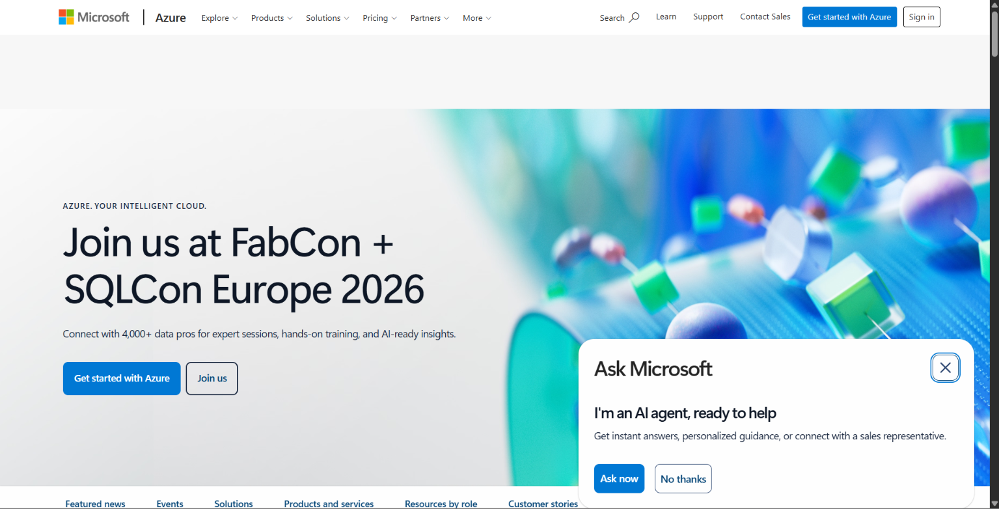

# 🔵 Microsoft Azure
### *The Enterprise's Cloud Companion*

> 🕵️ Researched from official Azure documentation as part of CloudNova's Cloud Evaluation Mission.

---

## 📌 Brief Overview
> *In a nutshell: what is Azure, who runs it, and why does it matter?*

Microsoft Azure is Microsoft's cloud computing platform. It provides services for computing, storage, databases, networking, security, artificial intelligence, and application development. Azure is especially useful for organizations that already use Microsoft technologies such as Windows Server, Microsoft 365, and Active Directory.

---

## 🌍 Global Infrastructure
> *How far does Azure's footprint reach?*

| Metric | Details |
|---|---|
| 🌐 Regions | **70+ regions worldwide** |
| 🏢 Availability Zones | **Available in many Azure regions** |
| 📶 Edge / Point-of-Presence Locations | **Global Azure edge/PoP network** |

---

## 🖥️ Cloud Management Console
> **Name:** Azure Portal

The Azure Portal is a web-based management interface where users can create and manage Azure resources. It can be used to deploy virtual machines, configure networks, manage databases and storage, monitor applications, and control access to cloud resources.

---

## 🧩 Four Core Services

| # | Service | Category | What It Does |
|---|---|---|---|
| 1️⃣ | **Azure Virtual Machines** | Compute | Provides virtual computers for running applications and operating systems. |
| 2️⃣ | **Azure Blob Storage** | Storage | Stores large amounts of unstructured data such as files, images, videos, and backups. |
| 3️⃣ | **Azure SQL Database** | Database | Provides a managed SQL database service for applications and business data. |
| 4️⃣ | **Azure Virtual Network** | Networking | Provides private networking for Azure resources and controls how resources communicate. |

---

## ⭐ Three Advantages

1. 🥇 **Strong Microsoft integration** – Works well with Windows Server, Microsoft 365, and Active Directory.
2. 🥈 **Enterprise-focused services** – Provides tools for security, compliance, management, and large organizations.
3. 🥉 **Hybrid cloud capabilities** – Makes it easier to connect existing on-premises systems with cloud resources.

---

## 🏢 Typical Enterprise Use Cases

- 🏫 **University and educational systems**
- 🔗 **Hybrid cloud environments connected to existing Microsoft infrastructure**
- 🔐 **Enterprise applications requiring strong identity and security management**

---

## 📸 Evidence

*Caption: Azure official homepage / portal screenshot*

---

> 💭 **Consultant's Note:** *What stood out to me about Azure is how well it connects cloud services with existing Microsoft technologies used by many organizations.*
