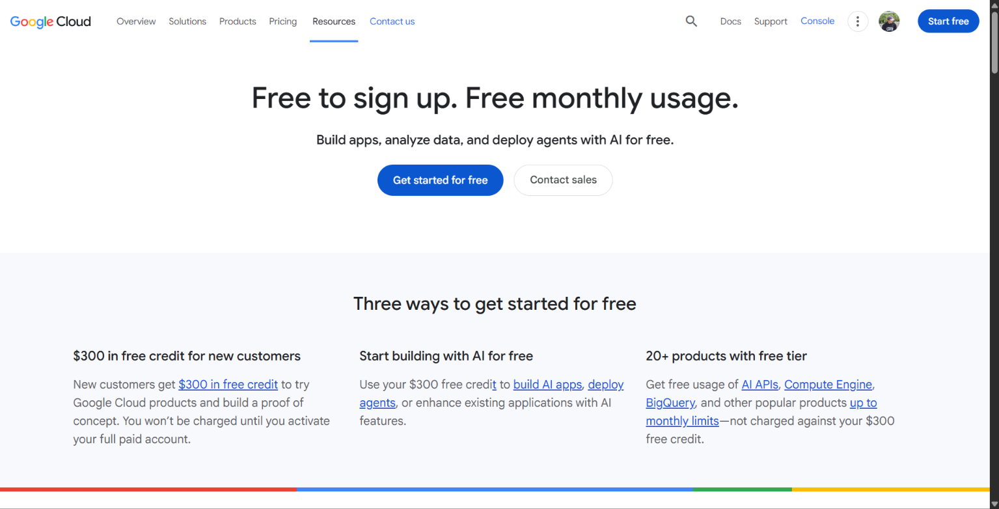

# 🔴 Google Cloud Platform (GCP)
### *The Data & AI Powerhouse*

> 🕵️ Researched from official GCP documentation as part of CloudNova's Cloud Evaluation Mission.

---

## 📌 Brief Overview
> *In a nutshell: what is GCP, who runs it, and why does it matter?*

Google Cloud Platform (GCP) is Google's cloud computing platform. It provides services for computing, storage, databases, networking, data analytics, artificial intelligence, and machine learning. GCP is particularly strong in data processing, AI/ML, and Kubernetes technologies.

---

## 🌍 Global Infrastructure
> *How far does GCP's footprint reach?*

| Metric | Details |
|---|---|
| 🌐 Regions | **43 regions** |
| 🏢 Zones | **130 zones** |
| 📶 Edge Points of Presence | **200+ network edge locations** |

---

## 🖥️ Cloud Management Console
> **Name:** Google Cloud Console

Google Cloud Console is a web-based interface for managing Google Cloud resources. Users can create virtual machines, manage storage and databases, configure networks, deploy applications, monitor resources, and manage security.

---

## 🧩 Four Core Services

| # | Service | Category | What It Does |
|---|---|---|---|
| 1️⃣ | **Compute Engine** | Compute | Provides configurable virtual machines for running applications and workloads. |
| 2️⃣ | **Cloud Storage** | Storage | Provides scalable object storage for files and other data. |
| 3️⃣ | **Cloud SQL** | Database | Provides managed relational databases such as MySQL and PostgreSQL. |
| 4️⃣ | **VPC Network** | Networking | Provides networking capabilities for connecting and controlling cloud resources. |

---

## ⭐ Three Advantages

1. 🥇 **Strong AI and machine learning capabilities**
2. 🥈 **Powerful data analytics services**
3. 🥉 **Excellent Kubernetes and container support**

---

## 🏢 Typical Enterprise Use Cases

- 🤖 **Artificial intelligence and machine learning**
- 📈 **Big data analytics and data processing**
- ☸️ **Containerized applications and Kubernetes deployments**

---

## 📸 Evidence

*Caption: GCP official homepage / console screenshot*

---

> 💭 **Consultant's Note:** *What stood out to me about GCP is its strong focus on AI, data analytics, and Kubernetes, making it attractive for modern technology workloads.*
