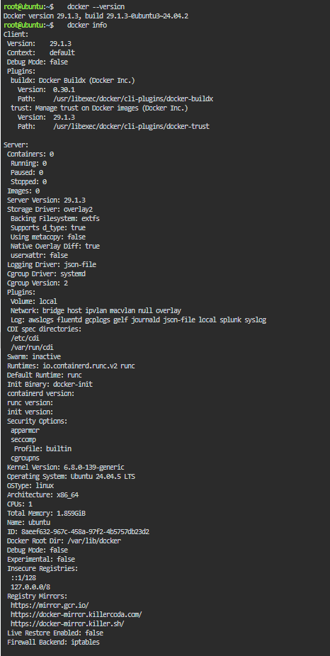
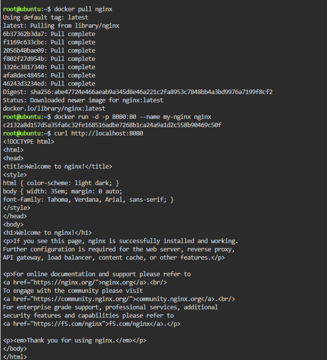
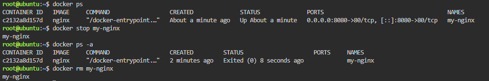

# 🐳 Docker Deployment Log

### *Everything I ran, in order, and what actually happened.*

---

## 🧾 Environment Check

Before I touched any containers, I wanted to confirm the playground was actually set up right:

- **Docker version:** `29.1.3`, build `29.1.3-0ubuntu3~24.04.2`
- **OS:** Ubuntu 24.04.5 LTS (kernel `6.8.0-139-generic`)
- **Architecture:** x86_64
- **Storage Driver:** overlay2
- **Starting state:** 0 containers, 0 images — clean slate

---

## 🛠️ What I Ran and Why

1. **`docker --version`**
   Just confirming Docker Engine `29.1.3` was actually there before I did anything else.

2. **`docker info`**
   Wanted a fuller status check — this showed me 0 containers, 0 images, running on Ubuntu 24.04.5 LTS with the `overlay2` storage driver.

3. **`docker pull nginx`**
   Pulled the official Nginx image from Docker Hub. Downloaded seven layers, resolved to digest `sha256:abe47724e466aeab9a345d8e46a221c2fa8953c7848bb4a3bd9976a7199f8cf2`.

4. **`docker run -d -p 8080:80 --name my-nginx nginx`**
   This actually created and started the container — ID came back as `c2132a8d157d` — running detached, with host port `8080` mapped to container port `80`.

5. **`curl http://localhost:8080`**
   The moment of truth. Sent a request to my mapped port and got the full "Welcome to nginx!" HTML page back, which meant the server inside the container was genuinely up and responding, not just running silently.

6. **`docker ps`**
   Checked on the running container — saw `c2132a8d157d`, image `nginx`, status `Up About a minute`, ports `0.0.0.0:8080->80/tcp, [::]:8080->80/tcp`, named `my-nginx`.

7. **`docker stop my-nginx`**
   Told it to shut down gracefully.

8. **`docker ps -a`**
   Checked again, this time including stopped containers, and confirmed `my-nginx` now showed `Exited (0) 8 seconds ago`.

9. **`docker rm my-nginx`**
   Deleted the container for good, since I was done with it.

---

## 📸 Screenshots

-  — output of `docker --version` and `docker info`
-  — pulling the image, running it, and the successful `curl` response
-  — listing, stopping, verifying, and removing the container

---

*From pull to removal, the whole thing probably took me under five minutes — way less time than I've spent waiting on a single VM to boot.* 🫡
